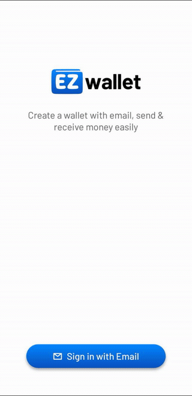
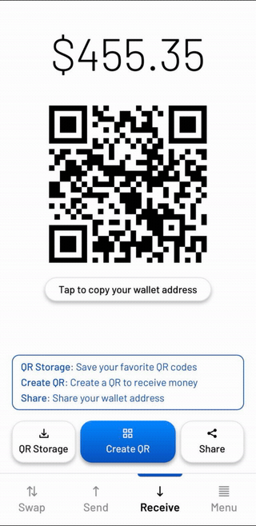
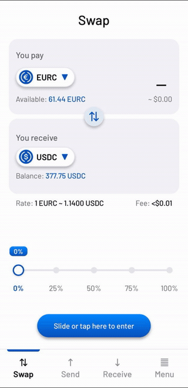
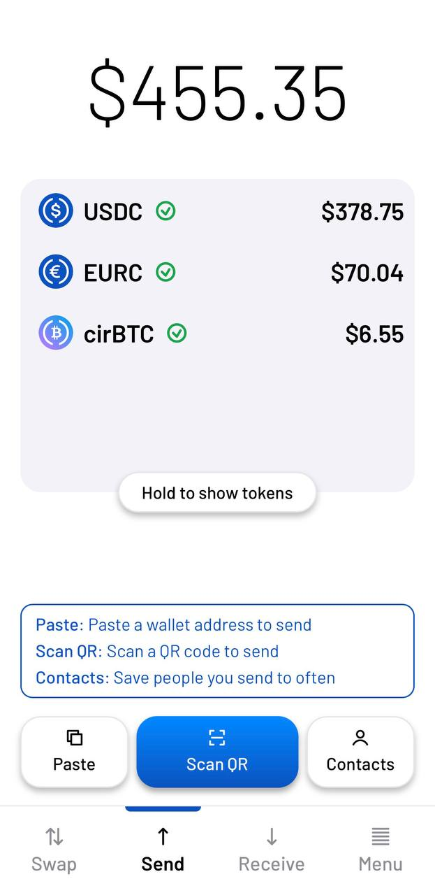
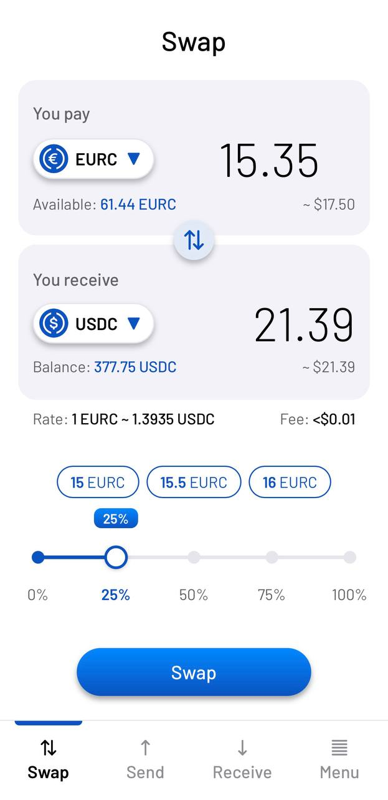
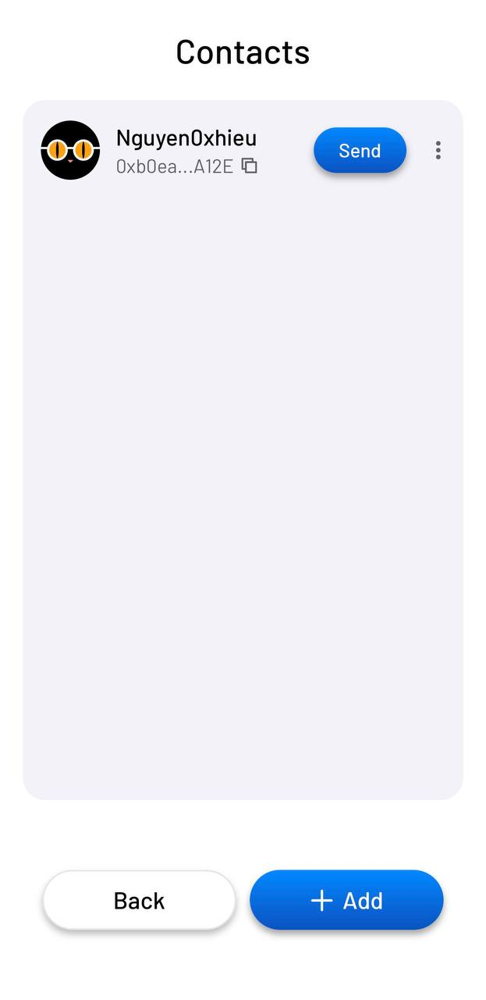
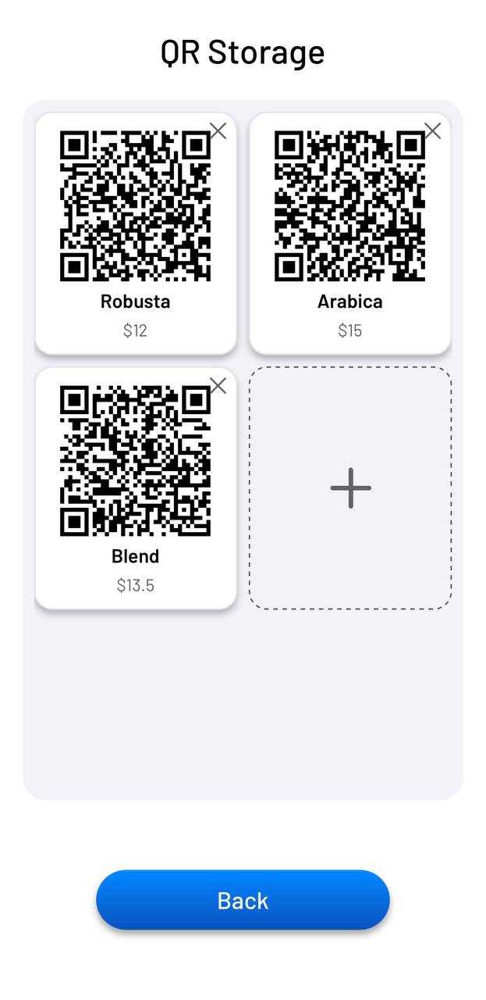
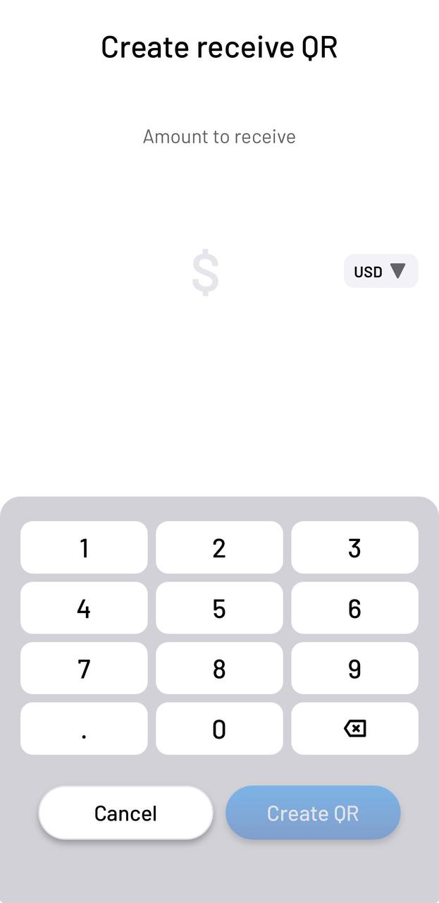

<div align="center">

# EZwallet

**A stablecoin wallet simple enough for your grandparents to use.**

<sub>*Ví stablecoin đơn giản đến mức ông bà cũng dùng được.*</sub>

[](https://ezwallet.pages.dev)
[](https://testnet.arcscan.app)
[](https://docs.google.com/presentation/d/1-MuqJeSV1Riwg3Bx6IXZSuNumqbtM83dmzG48-vIRDQ/edit?usp=sharing)
[](./LICENSE)

</div>

---

## Demo

<div align="center">

<table>
<tr>
<td align="center" width="50%"><br><sub><b>1 · Sign in with email + PIN</b></sub></td>
<td align="center" width="50%"><br><sub><b>2 · Send, with a note</b></sub></td>
</tr>
<tr>
<td align="center"><br><sub><b>3 · Receive by QR</b></sub></td>
<td align="center"><br><sub><b>4 · Swap by % slider</b></sub></td>
</tr>
</table>

</div>

---

### Screens

<div align="center">

<table>
<tr>
<td align="center" width="33%"><br><sub><b>Balance & tokens</b></sub></td>
<td align="center" width="33%"><br><sub><b>Swap by % slider</b></sub></td>
<td align="center" width="33%"><br><sub><b>Receive by QR</b></sub></td>
</tr>
<tr>
<td align="center"><br><sub><b>Contacts</b></sub></td>
<td align="center"><br><sub><b>Saved QR codes</b></sub></td>
<td align="center"><br><sub><b>Create a receive QR</b></sub></td>
</tr>
</table>

</div>

---

## The problem

Most crypto wallets are built for people who already understand crypto. Seed
phrases, gas tokens, hex addresses, network switching — every one of those is a
wall for a first-time user, and an outright dealbreaker for someone older who
just wants to send money to their family.

## The approach

EZwallet removes the crypto vocabulary from the surface:

- **No seed phrase.** Sign in with an email and a PIN.
- **No separate gas token.** Arc uses USDC as its native gas currency, so a user
  never has to buy a second coin just to move the first one.
- **Big type, few choices per screen.** Every screen is laid out on a fixed
  10-row grid with large text and one primary action, aimed at users with
  weaker eyesight and low tolerance for clutter.

## Features

| | |
|---|---|
| 🔑 **Email + PIN login** | No seed phrase to write down or lose. Keys are held in Circle's MPC infrastructure; the PIN authorises every signature. |
| 💸 **Send with a note** | Attach a short message to a transfer, so the receiver knows what the money is for. |
| 📷 **Receive by QR** | Show a QR to get paid. Optionally set an exact amount, name it, and keep it in a QR library for reuse. |
| 🔄 **Swap with a % slider** | Choose how much of your balance to convert by dragging a slider instead of typing decimals. Round-number shortcuts are offered as chips. |
| 👥 **Contacts** | Save addresses under a name (with an avatar) so you never paste a raw `0x…` twice. |
| 🧾 **History + receipts** | Full transaction history with per-transaction detail and a saveable receipt image. |
| 🌐 **Multi-currency display** | Show balances in USDC or EURC; the underlying token is always labelled honestly. |

## Tech stack

| Layer | What it uses |
|---|---|
| **Wallet** | [Circle User-Controlled Wallets](https://developers.circle.com/w3s/programmable-wallets) — MPC key management, PIN-based signing (`@circle-fin/w3s-pw-web-sdk`) |
| **Chain** | [Arc](https://docs.arc.io) L1 testnet (`chainId 5042002`) — **USDC is the native gas token** |
| **Swap** | Circle Stablecoin Kit, routed through LiFi |
| **Frontend** | React 18 + Vite 5, `viem` for on-chain reads, `qrcode.react` / `jsqr` for QR |
| **Backend** | Cloudflare Pages + Pages Functions (`functions/api/*`) — keeps the Circle API key server-side |

Tokens on Arc Testnet: **USDC**, **EURC**, **cirBTC**. Transfer notes are written
on-chain through Arc's Memo precompile.

## Try it

1. Open **[ezwallet.pages.dev](https://ezwallet.pages.dev)**.
2. Create a wallet with your **email** — you'll receive a one-time code, then set
   a 6-digit PIN.
3. Get test money: **Menu → Deposit**. This copies your wallet address and opens
   the [Circle faucet](https://faucet.circle.com/) — paste the address there.
4. Send some to a friend, or have them show you their QR.

> Everything runs on **Arc Testnet**. The money is test money and is worth nothing.

## Local setup

**Requirements:** Node.js 18+ (developed on Node 22), a
[Circle console](https://console.circle.com) account for API keys.

```bash
git clone https://github.com/KattyFury/ezwallet.git
cd ezwallet
npm install
```

Create your env file and fill in the keys:

```bash
cp .env.example .env.txt      # .env.txt is gitignored
```

| Variable | Needed for |
|---|---|
| `API_KEY` | Circle Programmable Wallets (login, PIN, send). `CIRCLE_API_KEY` also accepted. |
| `KIT_KEY` | Circle Stablecoin Kit — only needed for Swap. |

Then run the two processes in **separate terminals**:

```bash
npm run api     # Circle API proxy on http://localhost:8787
npm run dev     # Vite dev server on http://localhost:5173
```

Vite proxies `/api/*` to the local proxy, which mirrors what Cloudflare Pages
Functions do in production.

> ⚠️ **The Circle Web SDK does not run on `localhost`.** Login, PIN entry and
> swap can only be exercised on a deployed build. For local UI work use mock
> mode instead.

**Mock mode** — full UI with a fake wallet and fake balances, no Circle account
required:

```bash
npm run mock    # skips login/PIN, stubs the API and chain reads
```

Other scripts:

```bash
npm run build   # production build
npm test        # unit tests (node:test)
```

## Current limitations

Being upfront about what this is not, yet:

- **Testnet only.** Runs on Arc Testnet; balances have no real-world value.
- **No mainnet deployment.**
- **English-only UI.** The Circle PIN screen is a cross-origin iframe that only
  renders in English, so the rest of the app is kept in English to match. The
  i18n scaffolding exists but is disabled.
- **Google sign-in is not supported.** Email + PIN only.
- **QR scanning is limited to crypto wallet QR codes.** Real-world QR codes
  (product barcodes, bank QRs, etc.) are not handled.

## How this was built

EZwallet was built end to end in collaboration with AI — mostly Claude — by
someone with no professional programming background. The product decisions, the
UX rules and the design direction are human; the implementation was written
through conversation, then verified by actually running the flows and reading
the results.

If you're in the same boat: it's doable. Be specific about what you want, insist
on seeing it actually work, and don't accept "it should work" as an answer.

## License

[MIT](./LICENSE)
