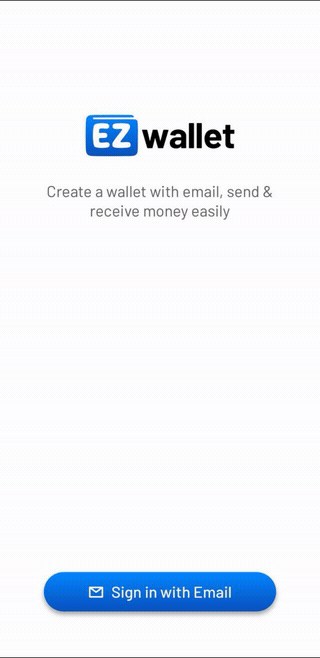
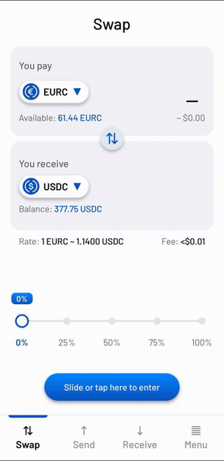
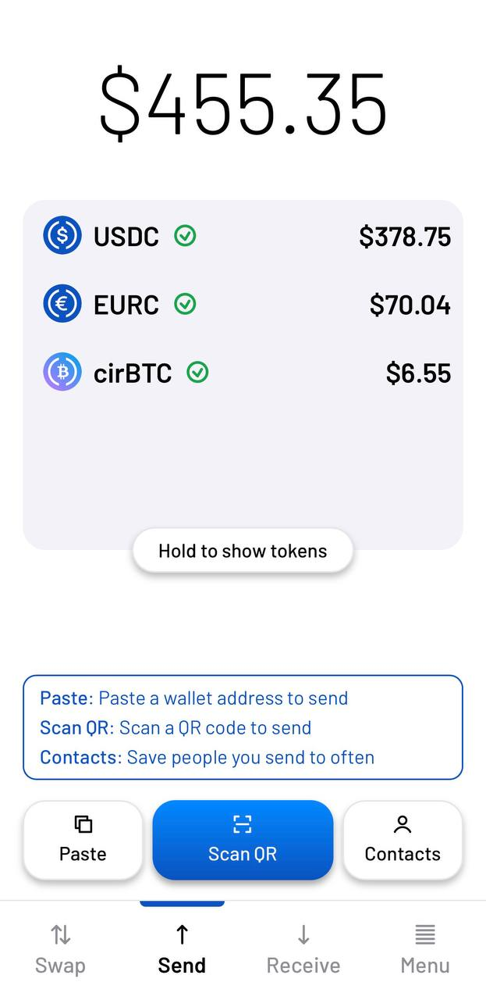
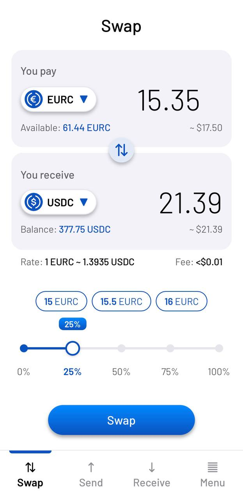
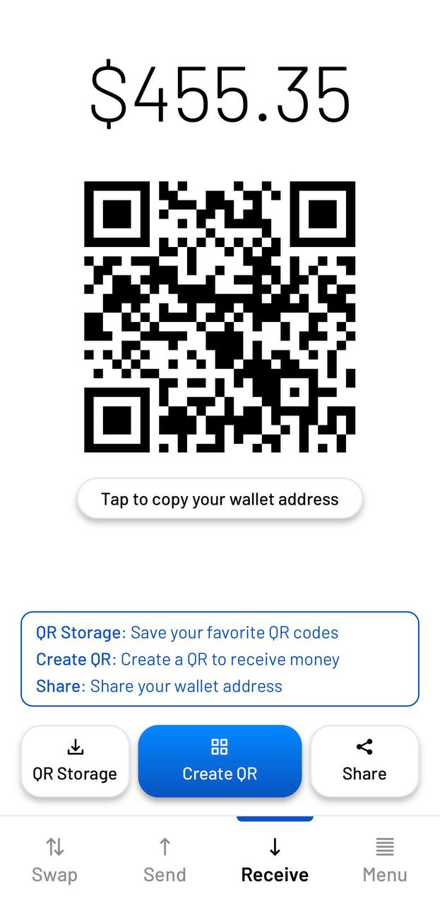
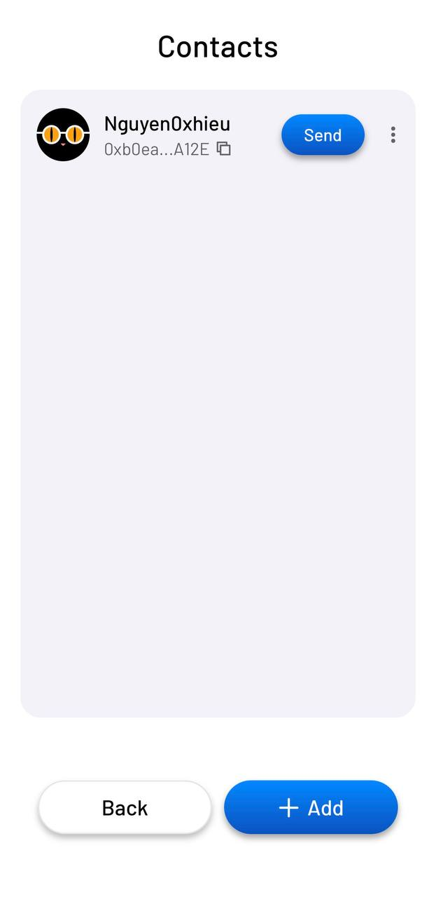
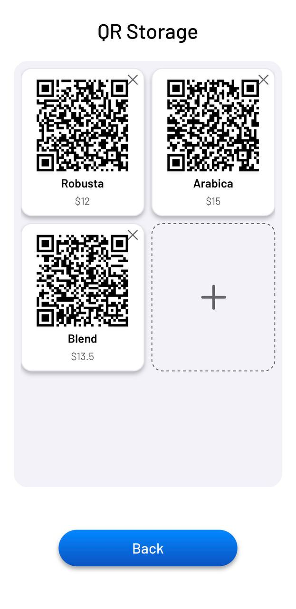
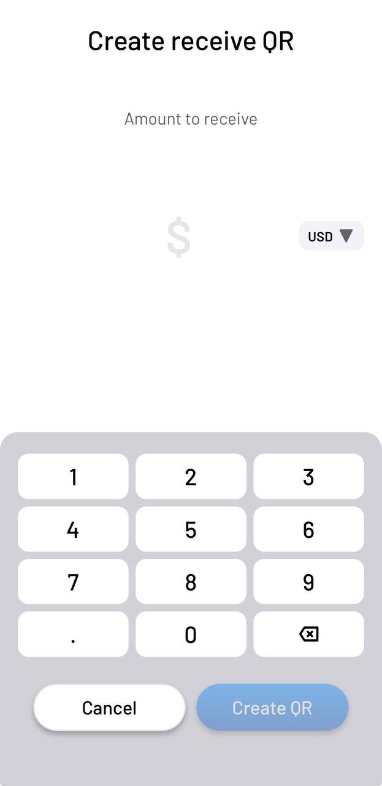

<div align="center">

# EZwallet

**A crypto wallet simple enough for my mom to use.**

[](https://ezwallet.cash)
[](https://testnet.arcscan.app)
[](https://docs.google.com/presentation/d/1-MuqJeSV1Riwg3Bx6IXZSuNumqbtM83dmzG48-vIRDQ/edit?usp=sharing)
[](./LICENSE)

</div>

---

## Demo

<div align="center">

<table>
<tr>
<td align="center" width="50%"><br><sub><b>1 · Sign in with email</b></sub></td>
<td align="center" width="50%"><br><sub><b>2 · Send, with a note</b></sub></td>
</tr>
<tr>
<td align="center"><br><sub><b>3 · Receive by QR</b></sub></td>
<td align="center"><br><sub><b>4 · Swap by % slider</b></sub></td>
</tr>
</table>

</div>

---

### Screens

<div align="center">

<table>
<tr>
<td align="center" width="33%"><br><sub><b>Balance & tokens</b></sub></td>
<td align="center" width="33%"><br><sub><b>Swap by % slider</b></sub></td>
<td align="center" width="33%"><br><sub><b>Receive by QR</b></sub></td>
</tr>
<tr>
<td align="center"><br><sub><b>Contacts</b></sub></td>
<td align="center"><br><sub><b>Saved QR codes</b></sub></td>
<td align="center"><br><sub><b>Create a receive QR</b></sub></td>
</tr>
</table>

</div>

---

## Core belief

> EZwallet was built on a simple belief: everyone should be able to own their
> own money, without needing to become a crypto expert.
>
> Self-custody shouldn't mean memorizing seed phrases, copying long wallet
> addresses, or worrying about gas tokens. Those are technical barriers, not
> the value of crypto.
>
> We believe people shouldn't have to adapt to crypto. Crypto should adapt to
> people, making it simple enough for anyone to use while preserving full
> ownership of their money.

Every product decision in this repo traces back to this belief.

## The problem

Most crypto wallets are built for people who already understand crypto. Seed
phrases, gas tokens, hex addresses, network switching – every one of those is a
wall for a first-time user, and an outright dealbreaker for someone older who
just wants to send money to their family.

## The approach

EZwallet removes the crypto vocabulary from the surface:

- **No seed phrase.** Sign in with an email, approve payments with your fingerprint.
- **No separate gas token.** Arc uses USDC as its native gas currency, so a user
  never has to buy a second coin just to move the first one.
- **Big type, few choices per screen.** Every screen is laid out on a fixed
  10-row grid with large text and one primary action, aimed at users with
  weaker eyesight and low tolerance for clutter.

## Features

| | |
|---|---|
| 🔑 **Email login, fingerprint to pay** | No seed phrase to write down or lose. The key is held in Privy's secure hardware; a fingerprint or Face ID is required before anything is signed. |
| 🗝️ **Your key, if you want it** | Export the private key at any time and open the same wallet in MetaMask or any other app. The wallet is yours whether or not EZwallet still exists. |
| 💸 **Send with a note** | Attach a short message to a transfer, so the receiver knows what the money is for. |
| 📷 **Receive by QR** | Show a QR to get paid. Optionally set an exact amount, name it, and keep it in a QR library for reuse. |
| 🔄 **Swap with a % slider** | Choose how much of your balance to convert by dragging a slider instead of typing decimals. Round-number shortcuts are offered as chips. |
| 👥 **Contacts** | Save addresses under a name (with an avatar) so you never paste a raw `0x…` twice. |
| 🧾 **History + receipts** | Full transaction history with per-transaction detail and a saveable receipt image. |
| 🌐 **Multi-currency display** | Show balances in USDC, EURC or Vietnamese dong; with VND you can also type the amount you want to send and the app converts it to USDC. The underlying token is always labelled honestly. |

## Tech stack

| Layer | What it uses |
|---|---|
| **Wallet** | [Privy embedded wallets](https://docs.privy.io) – the key lives in secure hardware, signing is gated by a passkey, and the user can export it (`@privy-io/react-auth`) |
| **Chain** | [Arc](https://docs.arc.io) L1 testnet (`chainId 5042002`) – **USDC is the native gas token** |
| **Swap** | Circle Stablecoin Kit, routed through LiFi |
| **Frontend** | React 18 + Vite 5, `viem` for on-chain reads and calldata, `qrcode.react` / `jsqr` for QR |
| **Backend** | Cloudflare Pages + Pages Functions (`functions/api/*`) – only for what genuinely needs a server: the Stablecoin Kit key, the KV-backed contacts backup, and bug reports. Signing happens in the browser. |

Tokens on Arc Testnet: **USDC**, **EURC**, **cirBTC**. Transfer notes are written
on-chain through Arc's Memo precompile.

## Try it

1. Open **[ezwallet.cash](https://ezwallet.cash)**.
2. Create a wallet with your **email** – you'll receive a one-time code, then you
   can turn on fingerprint or Face ID to approve payments.
3. Get test money: **Menu → Deposit**. This copies your wallet address and opens
   the [Circle faucet](https://faucet.circle.com/) – paste the address there.
4. Send some to a friend, or have them show you their QR.

> Everything runs on **Arc Testnet**. The money is test money and is worth nothing.

## Local setup

**Requirements:** Node.js 18+ (developed on Node 22), a
[Privy dashboard](https://dashboard.privy.io) app for the App ID, and a
[Circle console](https://console.circle.com) account if you want Swap to work.

```bash
git clone https://github.com/KattyFury/ezwallet.git
cd ezwallet
npm install
```

Create your env file and fill in the keys:

```bash
cp .env.example .env.txt      # .env.txt is gitignored
```

| Variable | Needed for |
|---|---|
| `KIT_KEY` | Circle Stablecoin Kit – only needed for Swap. The one secret left; everything else moved into the browser with Privy. |
| `VITE_PRIVY_APP_ID` | Optional. Your own Privy app instead of the built-in one. Not a secret – it ships in the bundle either way. |

Then run the two processes in **separate terminals**:

```bash
npm run api     # Swap/backup/bug-report proxy on http://localhost:8787
npm run dev     # Vite dev server on http://localhost:5173
```

Vite proxies `/api/*` to the local proxy, which mirrors what Cloudflare Pages
Functions do in production.

> Signing in and sending money now work on `localhost` – Privy has no
> deployed-origin requirement, unlike the Circle Web SDK this replaced. Add
> `http://localhost:5173` to the allowed domains in your Privy dashboard app.

**Mock mode** – full UI with a fake wallet and fake balances, no accounts
required at all:

```bash
npm run mock    # skips sign-in, stubs the API and chain reads
```

Other scripts:

```bash
npm run build   # production build
npm test        # unit tests (node:test)
```

## Current limitations

Being upfront about what this is not, yet:

- **Testnet only.** Runs on Arc Testnet; balances have no real-world value.
- **No mainnet deployment.**
- **English only.** The multi-language layer was removed on 2026-08-25 and adding
  a language now means designing it again from scratch.
- **Email sign-in only, for now.** Privy also supports Google, Apple, SMS,
  Telegram and others; enabling one is a line of config plus a switch in the
  Privy dashboard, but none are turned on yet.
- **QR scanning is limited to crypto wallet QR codes.** Real-world QR codes
  (product barcodes, bank QRs, etc.) are not handled.
- **Not audited.** See [SECURITY.md](./SECURITY.md) for the custody model, the known
  limitations, and how to report a vulnerability privately.

## How this was built

EZwallet was built end to end in collaboration with AI – mostly Claude – by
someone with no professional programming background. The product decisions, the
UX rules and the design direction are human; the implementation was written
through conversation, then verified by actually running the flows and reading
the results.

If you're in the same boat: it's doable. Be specific about what you want, insist
on seeing it actually work, and don't accept "it should work" as an answer.

## License

[MIT](./LICENSE)
